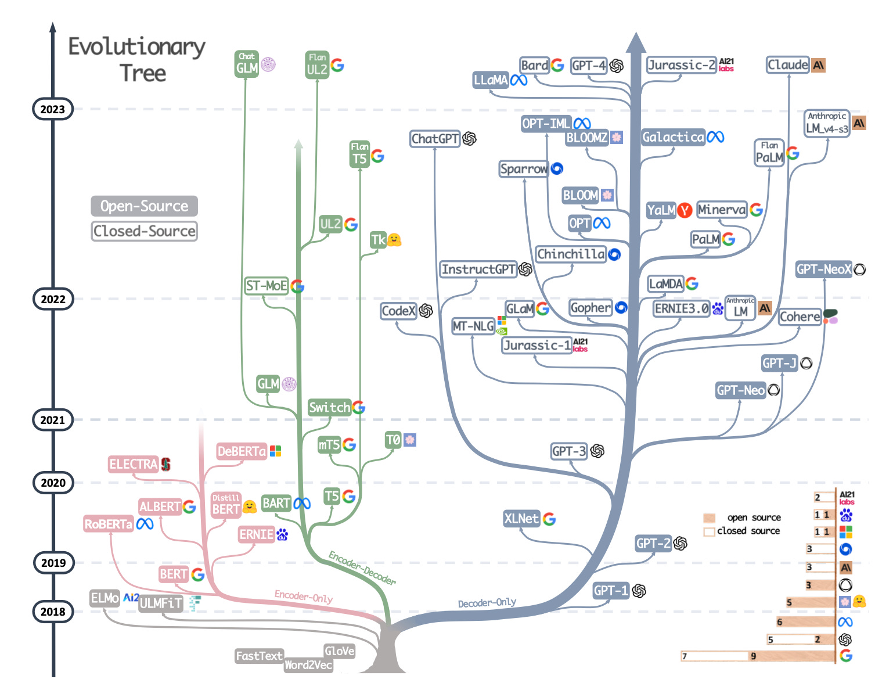

# Awesome Treasure of Large Language Models Collection

image source: https://arxiv.org/pdf/2304.13712.pdf

---

###  🧑‍💻👩‍💻Collection of All LLMs algorithm list with Code 🧑‍💻👩‍💻

---

| Sr No | Algorithm Name                                               | Year | Blog                                                         | Video                                                        | Official Repo                                                | Code                                                         |
| ----- | ------------------------------------------------------------ | ---- | ------------------------------------------------------------ | ------------------------------------------------------------ | ------------------------------------------------------------ | ------------------------------------------------------------ |
| 1     | [Awesome-LLM](https://github.com/Hannibal046/Awesome-LLM)             | 2023 |  |  |  |  |
| 2     | [Awesome-LLMOps](https://github.com/tensorchord/Awesome-LLMOps)            | 2023 |  |  |  |  |
| 3     | [Dolly](https://github.com/databrickslabs/dolly)            | 2023 |  |  |  |  |
| 4     | [Bloom](https://github.com/huggingface/transformers-bloom-inference)            | 2023 |  |  |  |  |
| 5     | [Vicuña](https://github.com/eddieali/Vicuna-AI-LLM)            | 2023 |  |  |  |  |
| 6     | [Alpaca](https://github.com/tatsu-lab/stanford_alpaca)            | 2023 |  |  |  |  |
| 7     | [LLaMA](https://github.com/facebookresearch/llama)            | 2023 |  |  |  |  |
| 8     | [GPT4All](https://github.com/nomic-ai/gpt4all)            | 2023 |  |  |  |  |

---

#### Instruction

* All blogs have links and some links contains different languages blog such as Chinese, Korean etc. for this Please use [Google Tranlater Page Convert](https://chrome.google.com/webstore/detail/google-translate/aapbdbdomjkkjkaonfhkkikfgjllcleb?hl=en).

---

#### How to Contribute

---

if you want to contribute on this project please send us email on : chetanraj002@gmail.com or ashishpatel.ce.2011@gmail.com. 

🙏🙏Special Thanks to [**Ashish Patel**](https://github.com/ashishpatel26) for contributing.

---

Copyright for source code belongs to the original author(s). However, under fair use you are encouraged to fork and contribute minor corrections and updates for the benefit of the reader(s).

---

**_Thanks for  Reading ...!!!_**

---
